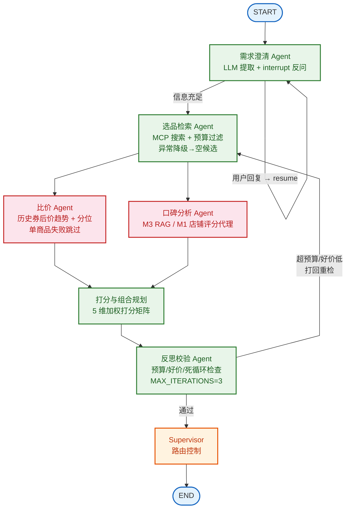

# BlackTea . 智购多智能体决策引擎

基于真实电商数据的多智能体购物**决策**引擎：把"我想买个好耳机""3000 元帮我配一套露营装备"这类模糊需求，变成带打分依据、方案对比、可解释的购买决策报告。

> 求职作品集项目 . 完整设计文档见 [PLAN.md](./PLAN.md) . 数据模型见 [docs/data-model.md](./docs/data-model.md)

## 亮点

- 多智能体协作：7 节点 LangGraph 图编排——需求澄清 / 选品检索 / 比价 / 口碑分析 / 打分排序 / 反思校验 / Supervisor 路由；关键节点 human-in-the-loop（`interrupt` 反问）
- fork-join 并行：search 后扇出 price 和 reputation 两条并行分支，各自只写独立 state key，汇聚到 scoring——较串行减少总延迟
- 容错体系：clarify interrupt 自环（信息不足自动暂停等用户补充）+ search 异常降级（MCP 失败不崩溃）+ price 单品跳过 + reflect 死循环保护（MAX_ITERATIONS=3）
- 决策引擎：单品加权打分矩阵（价格/口碑/销量/券力度/品牌 5 维）+ 组合场景预算约束优化（背包 DP），输出多套方案对比（M2）
- 方面级口碑 RAG：评论/测评按"续航/做工/售后"等维度聚合为结构化口碑分参与打分，而非泛泛摘要（M3）
- 记忆驱动个性化：双层记忆（PG 画像 + Milvus 情景记忆），召回动态调整决策权重（M3）
- MCP 工具化：自建 FastMCP server 封装大淘客 API，agent 经 langchain-mcp-adapters 按需挂载，可插拔
- 评估闭环：LangSmith trace + 自建评估集 + LLM-as-judge 打分回归（M4）

## 技术栈

LangChain . LangGraph . LangSmith . FastAPI . Vue3 . PostgreSQL . Milvus . Redis . FastMCP / langchain-mcp-adapters . Pydantic v2

## 智能体架构



## 数据源

- 淘宝：大淘客开放平台（openapi.dataoke.com），appKey 查询类接口 + 转链（默认 PID，项目不变现）
- 自建 FastMCP server 封装搜索/列表/历史券后价/转链/解析五个核心接口
- 项目仅做推荐决策研究，不涉及 CPS 推广变现

## 当前进度

| 里程碑 | 状态 | 完成项 |
|---|---|---|
| **M1 骨架** | 完成 | 大淘客 FastMCP server（5 工具）+ 归一化商品模型 + 数据模型 + 7 节点 LangGraph 图（fork-join 并行）+ interrupt 自环容错 + AsyncPostgresSaver checkpointer + FastAPI SSE 端点 + Vue3 对话流前端 + 14 个测试全绿 |
| M2 决策 | 待做 | 打分矩阵调优 + 组合优化（背包 DP）+ 反思升级（LLM 校验硬约束）+ 决策报告前端卡片增强 |
| M3 深度 | 待做 | 口碑 RAG（aspect-based）+ 双层记忆 + Skill 装载 |
| M4 质量 | 待做 | LangSmith 评估回归 + LLM-as-judge + 架构图完善 |

详细设计见 [PLAN.md](./PLAN.md) 第 9 节里程碑清单（带 checkbox）。

## 快速启动

### 前置

- Python 3.12 + conda 环境 `BlackTea`（`conda create -n BlackTea python=3.12`）
- Node.js 22+（前端 dev server）
- Docker（PG / Redis / Milvus）

### 1. 环境变量

```bash
cp .env.example .env
# 填入大淘客 appKey/appSecret、LLM API key、数据库连接等
```

### 2. 后端

```bash
# 安装依赖
pip install -r requirements.txt

# 启动基础设施（PG / Redis / Milvus）
docker-compose up -d

# 跑测试（14 个单元/集成测试）
cd backend/app && python -m pytest ../../backend/tests/ -v
# 或：
set PYTHONPATH=backend && python -m pytest backend/tests/ -v

# 启动 FastAPI（自动初始化 PG checkpointer + 编译 graph）
set PYTHONPATH=backend && python -m uvicorn app.main:app --reload --host 0.0.0.0 --port 8000
```

后端启动后访问 `http://localhost:8000/health`，返回 `{"status":"ok","graph_ready":true}` 即就绪。

### 3. 前端

```bash
cd frontend
npm install          # 安装 Vue3 + Pinia + Element Plus + Vite
npm run dev          # 启动 Vite dev server
```

前端启动后访问 `http://localhost:5173`，Vite 自动代理 `/api` 到后端 `localhost:8000`。

### 4. 使用流程

1. 在对话框输入购物需求，如"我想买个降噪耳机，预算 500 以内"
2. 如果信息不足（缺品类或预算），系统弹窗反问，补充后点"提交并继续"
3. 右侧 Agent 轨迹面板实时显示每个 agent 的执行进度
4. 反思通过后，右侧决策报告卡片显示推荐商品排名列表

## 项目结构

```
backend/
  app/
    config.py              # pydantic-settings 读 .env
    main.py                # FastAPI 入口（lifespan 初始化 checkpointer + graph）
    models/                 # Pydantic 数据模型
      product.py            #   NormalizedProduct 归一化商品
      requirement.py        #   ShoppingRequirement 需求结构
      decision.py           #   AspectScore / ScoredProduct / DecisionReport
    agents/                 # LangGraph 多智能体
      state.py             #   GraphState TypedDict
      clarify.py           #   需求澄清（interrupt 反问 + 自环容错）
      search.py            #   选品检索（MCP 搜索 + 异常降级）
      price.py             #   比价（历史券后价趋势，并行，单品跳过）
      reputation.py        #   口碑分析（M1 stub / M3 RAG，并行）
      scoring.py           #   打分矩阵 + 排序
      reflect.py           #   反思校验（预算/好价/死循环 MAX_ITERATIONS=3）
      supervisor.py        #   路由控制
      graph.py             #   build_graph(checkpointer=None) 图构建
      utils.py             #   LLM 工具函数
    adapters/dtk.py         # 大淘客原始响应 -> NormalizedProduct
    cache/redis.py          # Redis 缓存封装
    db/schema.sql           # PostgreSQL 业务表 DDL（app schema）
    db/checkpointer.py      # AsyncPostgresSaver 生命周期管理
    routes/chat.py          # SSE 流式对话端点（/api/chat + /api/chat/resume）
  mcp_dtk/                 # 自建 FastMCP server（大淘客封装）
    client.py              #   签名 + API 调用 + fixture 兜底
    tools.py               #   5 个 MCP 工具函数
    server.py              #   FastMCP 注册
    __main__.py            #   python -m mcp_dtk 入口
  tests/                    # 14 个单元/集成测试
docs/
  data-model.md             # 大淘客接口字段 + 数据模型设计
  mcp-dtk-guide.md          # FastMCP server 搭建指南
  checkpointer-guide.md     # PG checkpointer 接入指南
  fault-tolerance.md       # 容错机制设计（interrupt 自环 + 异常降级）
  architecture.mmd           # Mermaid 架构图源文件
frontend/                     # Vue3 前端
  src/
    main.js                   # Vue 应用入口（Pinia + Element Plus）
    App.vue                   # 主布局（左对话 + 右轨迹/报告）
    stores/chat.js            # 聊天状态管理（SSE 事件分发）
    api/sse.js               # fetch-based SSE 客户端（手动解析 SSE 帧）
    components/
      ChatWindow.vue          # 对话消息流 + 输入框
      AgentTimeline.vue       # agent 执行轨迹时间线
      InterruptDialog.vue      # interrupt 反问弹窗
      DecisionReport.vue      # 决策报告卡片
  package.json
  vite.config.js              # Vite dev server + /api 代理到后端
docker-compose.yml           # PG / Redis / Milvus / etcd / minio
requirements.txt
.env.example                 # 环境变量占位符
```

## 文档

| 文档 | 内容 |
|---|---|
| [PLAN.md](./PLAN.md) | 完整设计文档（API 盘点、架构、记忆设计、里程碑、测试） |
| [docs/data-model.md](./docs/data-model.md) | 大淘客 API 字段 + 数据模型设计（NormalizedProduct / PG / Milvus / Redis） |
| [docs/mcp-dtk-guide.md](./docs/mcp-dtk-guide.md) | 大淘客 FastMCP server 搭建指南 |
| [docs/checkpointer-guide.md](./docs/checkpointer-guide.md) | PG AsyncPostgresSaver checkpointer 接入指南 |
| [docs/fault-tolerance.md](./docs/fault-tolerance.md) | 容错机制设计（interrupt 自环 + 异常降级 + 死循环保护） |
| [docs/architecture.mmd](./docs/architecture.mmd) | Mermaid 架构图源文件 |