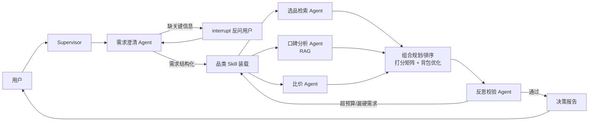

# BlackTea · 智购多智能体决策引擎

基于真实电商数据的多智能体购物**决策**引擎：把"我想买个好耳机""3000 元帮我配一套露营装备"这类模糊需求，变成带打分依据、方案对比、可解释的购买决策报告。

> 求职作品集项目 · 开发中（WIP）· 完整设计文档见 [PLAN.md](./PLAN.md)

## 亮点

- 多智能体协作：Supervisor + 需求澄清/选品检索/口碑分析/比价/组合规划/反思仲裁，关键节点 human-in-the-loop
- 决策引擎：单品加权打分矩阵 + 预算约束组合优化（背包问题），输出多套方案对比
- 方面级口碑 RAG：评论/测评按"续航/做工/售后"等维度聚合为结构化口碑分，而非泛泛摘要
- 记忆驱动个性化：双层记忆（PG 画像 + Milvus 情景记忆），召回动态调整决策权重
- MCP 工具市场：第三方 taoke-mcp 与自建 FastMCP（大淘客/和风天气）异构混排，可插拔
- 评估闭环：LangSmith trace + 自建评估集 + LLM-as-judge 打分回归

## 技术栈

LangChain · LangGraph · LangSmith · FastAPI · Vue3 · PostgreSQL · Milvus · Redis · FastMCP / langchain-mcp-adapters

## 智能体架构

## 数据源

- 拼多多：多多进宝，经 taoke-mcp（自托管 docker）接入
- 淘宝：大淘客开放平台，appKey 查询类接口 + 转链（默认 PID）
- 项目仅做推荐决策研究，不涉及 CPS 推广变现

## 里程碑

- M1 骨架：单 agent + 双数据源 + 归一化商品模型 + PG checkpointer + Vue3 最小对话流
- M2 决策：多 agent 拆分 + 打分矩阵 + 决策报告前端卡片
- M3 深度：口碑 RAG（方面级）+ 组合优化 + 双层记忆 + Skill 装载
- M4 质量：LangSmith 评估回归 + 反思机制 + 架构图完善
