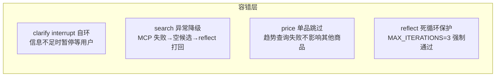

# 容错机制设计

> 2026-07-24 · BlackTea 多智能体图的容错与降级策略

## 1. 为什么需要容错

多智能体图里每个节点都可能在运行时失败：MCP API 超时、LLM 返回格式异常、网络抖动。如果任一节点抛异常，整个 LangGraph 崩溃，用户体验是"白屏"——这对于一个要拿来面试演示的项目是致命的。

容错的核心原则：**节点级失败不等于图级失败**。每个节点自己 catch 异常，降级处理，把结果（哪怕是失败的）写入 state，让图继续流转，由下游 reflect 判断是否打回或告知用户。

## 2. 容错机制全景



| 节点 | 失败场景 | 降级策略 | 恢复路径 |
|---|---|---|---|
| clarify | 用户信息不足（缺品类/预算） | `interrupt()` 暂停图，反问用户 | 用户回复 → `Command(resume=...)` → 自环重新提取 |
| search | MCP `search_goods` 调用异常 | catch → 返回空候选列表 + 错误消息 | reflect 检测到空候选 → 打回重检或告知用户 |
| price | 单商品 `get_price_trend` 失败 | catch → 跳过该商品，`is_good_price=True` 兜底 | 其他商品不受影响，scoring 用兜底分 |
| reputation | 无 DSR 评分数据 | 默认分 6.0（中等） | M3 接 Milvus RAG 后有独立来源 |
| scoring | 打分计算异常 | — | Pydantic 校验保底，不崩溃 |
| reflect | 反复打回无法收敛 | `iteration >= MAX_ITERATIONS(3)` | 强制通过，附"已重试 N 次"说明 |
| graph | 任一节点未捕获异常 | LangGraph 抛出，FastAPI 全局异常处理器兜底 | 返回 500 + 错误摘要，不白屏 |

## 3. clarify interrupt 自环（核心容错）

### 问题

旧代码 `graph.add_edge("clarify", "search")` 是无条件边。clarify 节点内部调 `interrupt()` 暂停图请求用户输入，`interrupt` 恢复后返回 `next_agent="clarify"`，但图只有一条 `clarify → search` 的边——结果信息还没补全就被自动放行到 search。

### 修复

```python
# graph.py
graph.add_conditional_edges(
    "clarify",
    route_from_clarify,   # 读 next_agent
    {
        "clarify": "clarify",  # interrupt 恢复 → 自环重新提取
        "search": "search",    # 信息充足 → 推进
    },
)
```

### interrupt 恢复流程

```
第 1 次调用 (thread_id=T)
  1. clarify 执行：LLM 提取需求 → 缺预算
  2. interrupt("请输入预算") → 暂停，checkpoint 写入 PG
  3. 返回 interrupt 信息给前端

用户回复 "200 元"

第 2 次调用 (thread_id=T, Command(resume="200元"))
  4. 从 checkpoint 恢复
  5. interrupt() 返回 "200 元"
  6. 节点继续：answer 写入 messages，next_agent="clarify"
  7. 条件边：next_agent="clarify" → 自环重新进入 clarify

重新进入 clarify（新节点执行，非 resume）
  8. LLM 从全部 messages 提取（含用户新回复）
  9. 检查 → 信息充足 → next_agent="search"
  10. 条件边：next_agent="search" → 推进到 search
```

关键点：第 7 步的自环是**全新的节点执行**（不是 interrupt resume），所以 LLM 提取会重新跑一遍，能正确解析用户新补充的信息。

## 4. search 异常降级

```python
# search.py
try:
    products = await search_goods(...)
except Exception as e:
    logger.error("search_goods MCP 调用失败: %s", e)
    error_msg = f"（检索异常：{type(e).__name__}，将重试）"
    # products 保持空列表，不抛异常
```

降级链路：MCP 失败 → 空候选 → reflect 检测 `not scored` → 打回 search 重试 → 重试仍失败 → `MAX_ITERATIONS` 强制通过 → 报告附"检索异常"说明。

## 5. price 单品跳过

```python
# price.py
for p in products[:10]:
    try:
        trend = await get_price_trend(p.goods_id)
        ...
    except Exception:
        continue  # 单品查询失败不影响整体
```

某个商品的价格趋势查不到，该商品在 `price_analysis` 里就没有条目，scoring 评分时 `is_good_price` 默认为 `True`（不否决），不影响其他商品的打分。

## 6. reflect 死循环保护

```python
# reflect.py
MAX_ITERATIONS = 3

if iteration >= MAX_ITERATIONS:
    notes.append(f"已达最大反思次数 {MAX_ITERATIONS}，强制通过")
    issues = []  # 放弃检查，生成报告
```

防止 reflect → search → ... → reflect 无限循环。超过 3 轮后强制通过，在决策报告的 `reflection_notes` 里留痕，前端可展示"已重试 N 次后输出当前最优方案"。

## 7. 面试可讲的点

- **interrupt 自环是条件边不是回边**：LangGraph 的 `interrupt()` 是节点内机制，自环是通过 `add_conditional_edges` 读 `next_agent` 实现的，图编译后 LangGraph 验证无环冲突。
- **节点级 catch vs 图级崩溃**：每个 agent 自己处理异常并降级返回 state，避免一个 API 超时让整个多智能体对话崩溃——这是生产级 AI 应用的基本要求。
- **reflect 打回 + 死循环保护组合**：打回机制保证质量（不满意重做），`MAX_ITERATIONS` 保护保证收敛（不会无限重做），两者缺一不可。
- **interrupt 恢复后自环重新提取**：不是简单地从暂停点继续，而是重新跑一遍 LLM 提取，确保用户新输入被正确解析——面试时可以讲这个设计决策的 trade-off。